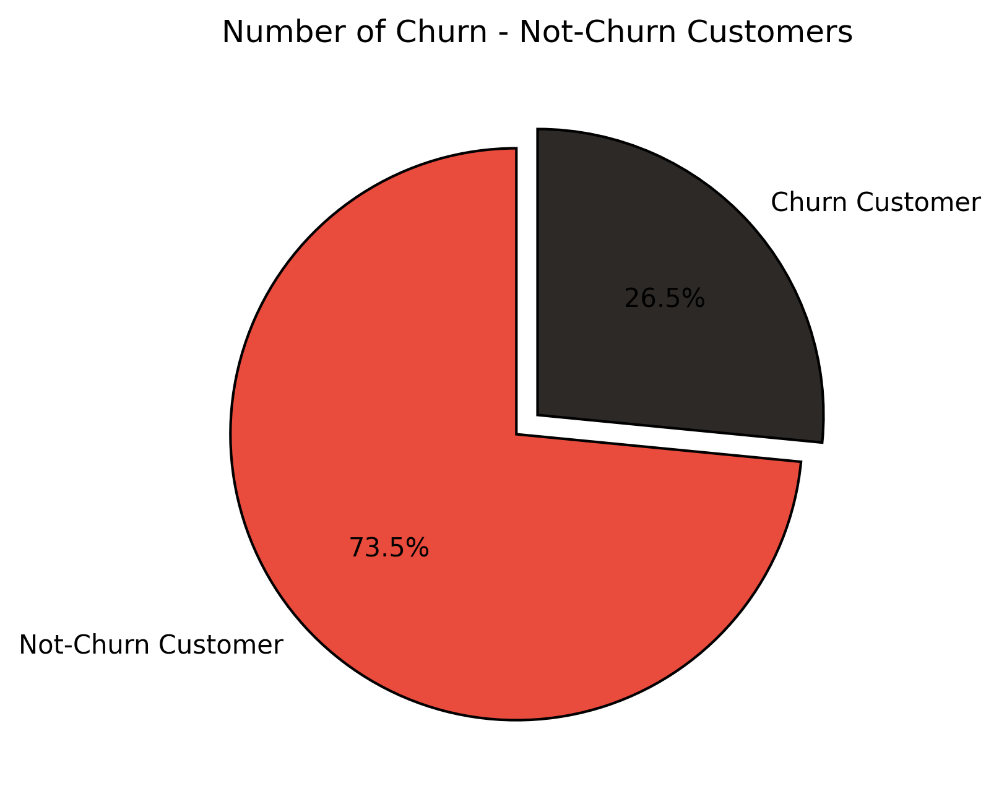
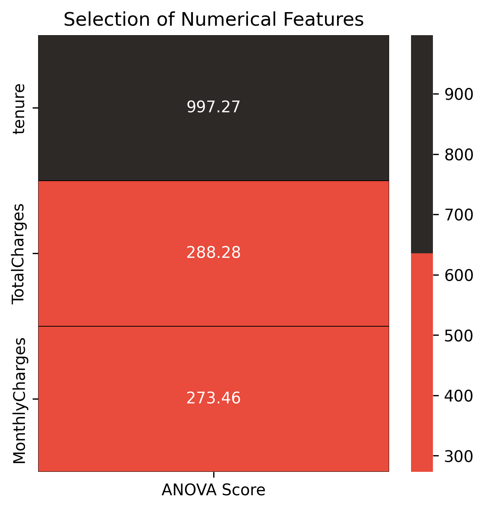
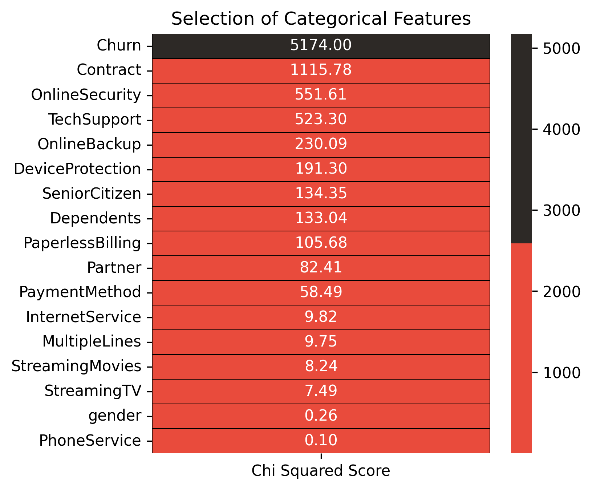
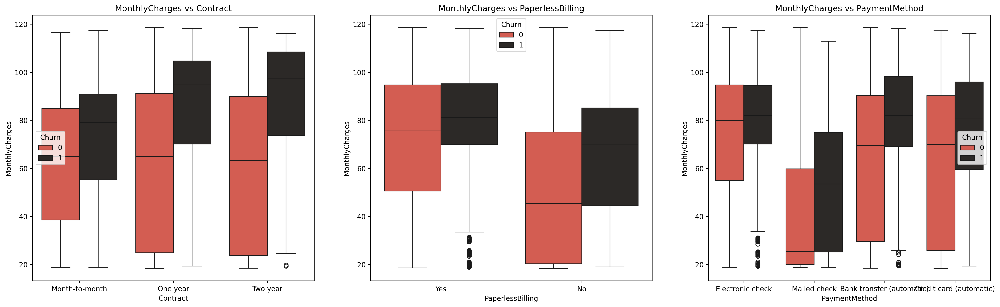
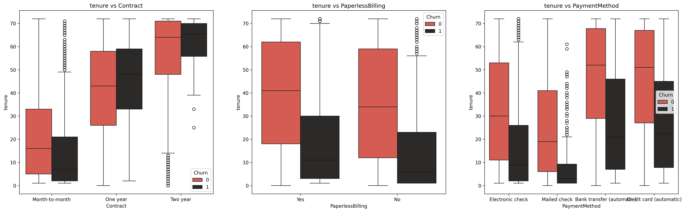
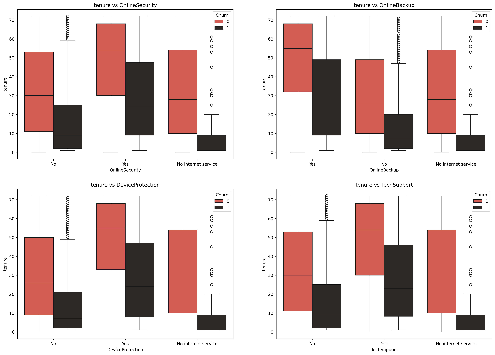

## Telco Customer Churn Prediction

This project aims to develop a machine learning model to predict customer churn for a telecommunications company. By analyzing customer demographics, subscribed services, contract details, and financial data, we will identify key factors influencing customer retention and churn.

### Project Overview

Before building predictive models, exploratory data analysis (EDA) and feature engineering are conducted to understand patterns, distributions, and relationships within the dataset.

### Dataset Overview

The dataset contains customer-related information including demographics, subscribed services, contract details, billing amounts, and churn status.

### Variables in the Dataset:

CustomerID: Unique identifier for each customer

Gender: Customer's gender

SeniorCitizen: Indicator if customer is a senior citizen (1: Yes, 0: No)

Partner: Whether the customer has a partner (Yes/No)

Dependents: Indicator if the customer has dependents (Yes/No)

Tenure: Duration (in months) the customer has been with the company

PhoneService: Whether the customer has phone service (Yes/No)

MultipleLines: Whether the customer has multiple lines (Yes/No/No phone service)

InternetService: Type of internet service (DSL/Fiber Optic/No internet service)

OnlineSecurity: Availability of online security service (Yes/No/No internet service)

OnlineBackup: Availability of online backup service (Yes/No/No internet service)

DeviceProtection: Availability of device protection (Yes/No/No internet service)

TechSupport: Availability of technical support (Yes/No/No internet service)

StreamingTV: Availability of TV streaming (Yes/No/No internet service)

StreamingMovies: Availability of movie streaming (Yes/No/No internet service)

Contract: Contract type (Month-to-month, One year, Two years)

PaperlessBilling: Usage of paperless billing (Yes/No)

PaymentMethod: Payment method used (Electronic check, Mailed check, Bank transfer (automatic), Credit card (automatic))

MonthlyCharges: Monthly charges billed to the customer

TotalCharges: Total charges billed to the customer

Churn: Whether the customer churned (left the company) (Yes/No)

### Exploratory Data Analysis (EDA)

EDA was performed to gain insights into customer churn patterns:

Key Insights from EDA:

Tenure: Average tenure is ~32 months, indicating a mix of new and long-term customers.

Monthly Charges: Average charges are around $64.76, with a range of $18.25 to $118.75.

Total Charges: The distribution is skewed, with charges averaging ~$2279.73 and a maximum around $8684.80.

Churn rates were significantly higher for customers:

On month-to-month contracts

Using electronic check payments

Without partners or dependents

Without additional services such as online security or tech support

Paying higher monthly charges (>$70)

### Visual Insights:

Churn Distribution: Highlights a significant churn rate (~26.5%), indicating critical retention issues.
    

Numerical Features ANOVA Scores: Indicates that tenure has the highest predictive importance, followed by MonthlyCharges and TotalCharges.
    

Categorical Features Importance: Identifies crucial categorical features influencing churn (e.g., Contract type, OnlineSecurity).
    

Monthly Charges vs. Services: Demonstrates customer churn related to pricing of Fiber Optic and Streaming services.
    

Tenure vs. Billing & Payment Methods: Reveals critical tenure periods where customers reconsider their billing and payment methods.
    

Tenure vs. Additional Services: Highlights customer retention patterns concerning OnlineSecurity, OnlineBackup, DeviceProtection, and TechSupport.
    

Correlation Matrix Heatmap: Visualizes relationships among numerical features.
    

### Feature Engineering and Preprocessing

Missing Values:

TotalCharges column had missing values corresponding to new customers (tenure = 0). These were addressed by either removing or imputing.

Data Scaling:

Normalization was applied to skewed numerical variables (tenure, MonthlyCharges, TotalCharges).

No standardization was performed due to the absence of normally distributed variables.

### Feature Selection:

ANOVA tests indicated all numerical features are relevant and retained for modeling.

### Handling Imbalanced Data

The dataset was imbalanced (~3:1 ratio of non-churn to churn). Oversampling techniques (using imblearn) were applied to balance the classes.

### Modeling

The following classifiers were trained and evaluated:

XGBoost Classifier: Strong performance on structured data.

LightGBM Classifier: Efficient on large datasets with categorical features.

Random Forest Classifier: Effective against overfitting and handles high-dimensional data.

Decision Tree Classifier: Baseline and interpretability.

Stacked Model: Combined predictions from above classifiers for improved accuracy.

### Recommendations for Reducing Customer Churn

Target three critical segments:

Senior citizens (willing to pay premium but require higher service quality)

Customers living alone

Customers living with a partner

Enhance customer support and additional services (Online Security, Backup, Device Protection, Tech Support), especially in the initial six-month period.

Offer bundled services (MultipleLines + DSL or Fiber Optic without multiple lines) to optimize monthly charges ($100-$120 range), increasing overall revenue.

Improve affordability and accessibility of StreamingTV and StreamingMovies.

Replace electronic check payments with automated methods (Bank Transfer and Credit Card) to reduce churn due to payment issues.

Reassess and streamline Paperless Billing as it currently shows higher churn rates.

Installation

1. Clone the repository:

git clone https://github.com/yourusername/Telco-Customer-Churn-Prediction.git
cd Telco-Customer-Churn-Prediction

2. Create and activate a Conda environment:

conda create -n churn_env python=3.10
conda activate churn_env

3. Install dependencies:

pip install -r requirements.txt

Usage

Open the Jupyter notebook (Telco Customer Churn Prediction.ipynb) in VS Code or Jupyter Notebook to run the analysis and model training.

Conclusion

This project demonstrates a comprehensive approach to predicting and understanding customer churn, providing actionable insights through detailed exploratory analysis, robust feature engineering, and advanced modeling techniques.